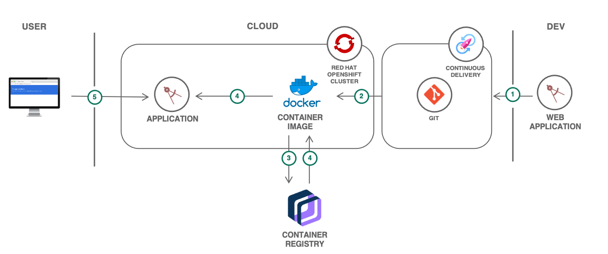

    

    
    
    

# Scalable web application on OpenShift

> This repository is a companion code sample for a [solution tutorial](https://cloud.ibm.com/docs/solution-tutorials?topic=solution-tutorials-scalable-webapp-openshift)

The tutorial walks you through how to push your code to a private Git repository, deploy it to a Red Hat OpenShift on IBM Cloud cluster and then automate the build and deploy process. Additionally, you will learn how to expose the app on an OpenShift route, bind a custom domain, monitor the health of the environment, and scale the application.
{:shortdesc}

With Red Hat OpenShift on IBM Cloud, you can create IBM Cloud Kubernetes Service clusters with worker nodes that come installed with the Red Hat OpenShift on IBM Cloud Container Platform orchestration software. You get all the advantages of managed IBM Cloud Kubernetes Service for your cluster infrastructure environment, while using the OpenShift tooling and catalog that runs on Red Hat Enterprise Linux for your app deployments.

For step-by-step instructions, refer this [tutorial](https://cloud.ibm.com/docs/solution-tutorials?topic=solution-tutorials-scalable-webapp-openshift)

[The tutorials are part of the IBM Cloud documentation](https://cloud.ibm.com/docs/solution-tutorials?topic=solution-tutorials-tutorials#tutorials).

### Starter application
The starter application is scaffolded using [IBM Cloud Developer Tools CLI](https://cloud.ibm.com/docs/apps?topic=apps-create-deploy-app-cli) `ibmcloud dev`.
